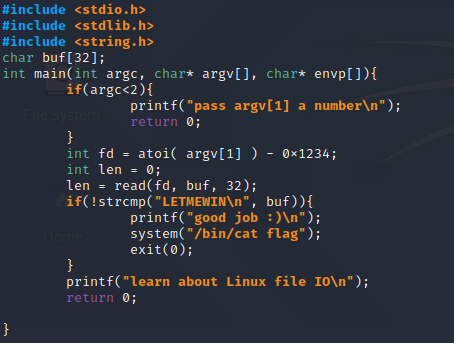

# ctf-training

Binary Exploitation
https://pwnable.kr/

Luego de ingresar a la máquina huesped usando:

```fd@pwnable:~$ ssh fd@pwnable.kr -p2222```

Al inspeccionar el directorio actual se encuentran los siguientes archivos: 


Aqui podemos observar que se encuentra un archivo llamado flag pero no tenemos permisos debido a que el archivo flag solo tiene acceso el usuario fd_pwn y el grupo root

`uid=1002(fd) gid=1002(fd) groups=1002(fd)`

Como no podemos ejecutar **`cat`** para leer la flag directamente buscamos otra forma de acceder.
Si nos fijamos en los permisos del archivo **fd** tiene permisos de usuario **fd_pwn** y de grupo **fd**, como somos parte del mismo grupo tomaremos esta camino.

```
fd@pwnable:~$ file fd
fd: setuid ELF 32-bit LSB executable, Intel 80386, version 1 (SYSV), dynamically linked, interpreter /lib/ld-, for GNU/Linux 2.6.24, BuildID[sha1]=c5ecc1690866b3bb085d59e87aad26a1e386aaeb, not stripped
 ```
 
 **fd** es un archivo ejecutable, además de este archivo tenemos a la mano el archivo **fd.c** que contiene el código fuente. 
 
 
 
 De este código podemos destacar lo siguiente, si no se ingresa un segundo parámetro cuando se ejecute el programa,
 entonces mostrará **"pass argv[1] a number\n"** y termina su ejecución.
 
 Cuando pasamos como segundo parámetro un número entonces el código si puede ejecutarse, en caso de acertar el número que pide la función entonces nos mostrará la flag, caso contrario mostrará "learn about Linux IO\n"
 
 Un recurso para entender Linux IO es el siguiente:
 https://www.classes.cs.uchicago.edu/archive/2017/winter/51081-1/LabFAQ/lab2/fileio.html 
 
 En la documentación de la función read indica que se necesitan tres parámetros: un file descriptor, un bufer y el tamano del buffer
 
 ```ssize_t read(int fd, void *buf, size_t count);``` 

 Los file descriptor pueden ser de tres tipos, *`tipo 0`*  o *`Standard Input`* , *`tipo 1`* o *`Standard Output`* y *`tipo 2`* o *`Standard Error`*. Como luego de la funciòn read() necesita comparar una cadena con **LETMEWIN** el file descriptor que necesitamos es el tipo 0.
 Para lograr que el fd tome el valor de cero el valor de atoi(argv[1]) debe ser 0x1234  que en decimal seria 4660. Con estos datos ahora si ejecutamos nuevamente el archivo fd junto a 4660 obtenemos la flag.
 


mommy!#######################################is!!
